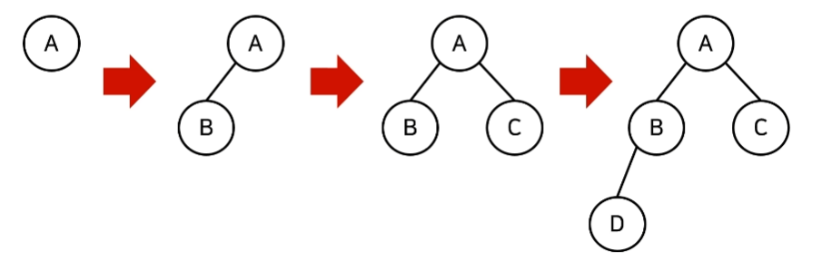

## 우선순위 큐(Priority Queue)

- 우선순위가 가장 높은 데이터를 먼저 삭제하는 자료구조
- 예) 물건 데이터를 자료구조에 넣었다가 가치가 높은 물건부터 꺼내서 확인해야 하는 경우

- 구현하는 방법 (+ 데이터 개수가 N개일 때 구현방식에 따라서 시간 복잡도 비교)
    - **리스트**
        - 삽입 시간: O(1)
        - 삭제 시간: O(N)
    - **힙(heap)**
        - 삽입 시간: O(logN)
        - 삭제 시간: O(logN)
    - 단순히 N개의 데이터를 힙에 넣었다가 모든 꺼내는 작업은 정렬과 동일(**힙 정렬**)
        - 이 경우 시간 복잡도: O(NlogN)

<br>

### 힙(Heap)
- 완전 이진 트리 자료구조의 일종
    - 완전 이진트리: 루트 노드부터 시작하여 왼쪽 자식 노드, 오른쪽 자식 노드 순서대로 데이터가 차례대로 삽입되는 트리(tree)
    

- 항상 **루트 노드(root node) 제거**
- 힙에서 원소 제거될 때는 가장 마지막 노드가 루트 노드의 위치에 오도록 함

- **최소 힙(min heap)**
    - 루트 노드가 가장 작은 값
    - 값이 작은 데이터가 우선적으로 제거
    - 데이터를 넣은 후 꺼내는 작업이 오름차순 정렬과 같음
    - 최소 힙 구성 함수: `Min-Heapify()`
        - (상향식) 부모 노드로 거슬로 올라가면서, 부모보다 자신의 값이 더 작은 경우 위치 교체
        - 제거 시에는 하향식으로 더 작은 자식 노드로 `Heapify()`

- **최대 힙(max heap)**
    - 루트 노드가 가장 큰 값
    - 값이 큰 데이터가 우선적으로 제거
    - 내림차순 정렬


- 우선순위 큐 라이브러리를 활용한 힙 정렬 구현 예제
    - 최대 힙의 경우에는 데이터를 넣을 때와 꺼낼 때 *마이너스* 붙이면 됨
```python
import sys
import heapq
input = sys.stdin.readline

def heapsort(iterable):
    h = []
    result = []
    # 모든 원소를 차례대로 힙에 삽입
    for value in iterable:
        heapq.heappush(h, value)
    # 힙에 삽입된 모든 원소를 차례대로 꺼내어 담기
    for i in range(len(h)):
        result.append(heapq.heappop(h))
    return result

n = int(input())
arr = []

for i in range(n):
    arr.append(int(input()))

res = heapsort(arr)

for i in range(n):
    print(res[i])
```
