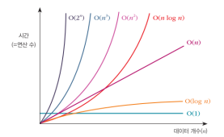

## 자료구조_알고리즘_소개
- 자료구조: 요리 재료 + 다듬는 방법(코딩)
- 알고리즘: 요리법

 

## 자료구조
> 컴퓨터 프로그래밍 언어에서 효율적인 자료(데이터)의 형태
### **선형** 자료구조
- **리스트**
    - *선형 리스트(순차 리스트)
        - 배열, 빈틈 없다
        - 장점: 메모리 절약, 비용 저렴, 전체 데이터 접근 빠름
        - 단점: 삽입/삭제 시 Overhead(되기는 되는데 오래 걸림)
        - 예: 신문사 기사 데이터(날짜별), 소설 연대별 기록 --> 시간 순서로 발생/기록되는 데이터에 적합
    - **단순 연결 리스트
        - 노드(Data + Link)
        - 논리적으로 붙어있지만 물리적으론 멂
        - 장점: 삽입/삭제 시 오버헤드 X
        - 단점: 메모리 더 필요, 전체 접근 느림
        - 마지막 노드의 link == None
    - 원형 연결 리스트
        - 마지막 노드의 link == Head
- **스택**: 한쪽 막힌 파이프, FILO, `push()`, `pop()`, `top`, `isStackFull()`, `isStackEmpty()`
- **큐**
    - *순차 큐(일반 큐): 양쪽이 뚫린 파이프, FIFO, `enQueue()`, `deQueue()`, `front`, `rear`, `isQueueFull()`
        - 초기값: `front=rear=-1`
        - 대용량 시 오버헤드
    - ***원형 큐(환형 큐): 꼬리가 다시 머리로 연결된 구조
        - 초기값: `front=rear=0`
        - enQueue: `rear = (rear + 1) % SIZE`
        - deQueue: `front = (front + 1) % SIZE`

### **비선형** 자료구조
- ***트리
    - 이진 트리
        - **이진 탐색트리**: TreeNode(left, data, right), 작왼큰오
    - (쿼드 트리): 지도
- 그래프
    - 무방향/방향
    - 깊이우선/너비우선
    - (인접 행렬)

 

## 알고리즘
> 어떤 문제를 해결해 가는 논리적인 과정
### 정렬
- ****선택 정렬**: 최솟값 찾기
- (버블 정렬/퀵 정렬)

### 검색
- 순차 검색: 정렬 안됐을 경우
- **이진 검색: 정렬됨, O(log n)

### 재귀
- 사례로 학습

 

### 알고리즘의 성능
