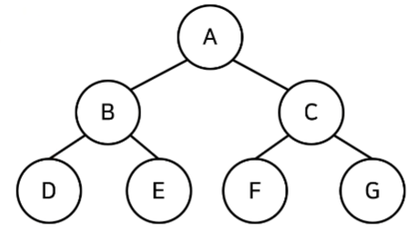

## 활용도가 높은 자료구조: 트리 자료구조

<br>

### 트리(Tree)

- 계층적인 구조 표현할 때 사용할 수 있는 자료구조
- 예: 가계도

- 트리 관련 용어
    - 루트 노드(root node): 부모가 없는 최상위 노드
    - 단말 노드(leaf node): 자식이 없는 노드
    - 크기(size): 트리에 포함된 모든 노드의 개수
    - 깊이(depth): 루트 노드로부터의 거리
    - 높이(height): 깊이 중 최댓값
    - 차수(degree): 각 노드의 자식 방향 간선 개수 
    - 기본적으로 트리의 크기가 N일 때, 전체 간선의 개수는 N - 1개

<br>

### 이진 탐색 트리(Binary Search Tree)

- 이진 탐색이 동작할 수 있도록 고안된 효율적인 탐색이 가능한 자료구조
- **왼쪽 자식노드 < 부모 노드 < 오른쪽 자식 노드**
- 데이터 조회 시 찾고자 하는 원소의 크기에 따라 왼쪽 자식노드/ 오른쪽 자식노드 둘 중 하나를 방문하기 때문에 탐색 범위가 절반 가까이 줄어듦
- 왼쪽과 오른쪽이 균형이 잡혀있을 때 이상적

<br>

### 트리의 순회(Tree Traversal)
- 트리 자료구조에 포함된 노드를 특정한 방법으로 한 번씩 방문하는 방법
- 트리 정보를 시각적으로 확인 가능
- 대표적인 트리 순회 방법
    - **전위 순회(pre-order traverse)**: 루트 먼저 방문
    - **중위 순회(in-order traverse)**: 왼쪽 자식을 방문한 뒤에 루트 방문
    - **후위 순회(post-order traverse)**: 왼쪽과 오른쪽 오른쪽 자식을 방문한 뒤에 루트 방문

예)


- **전위 순회(pre-order traverse)**: A - B - D - E - C - F - G
- **중위 순회(in-order traverse)**: D - B - E - A - F - C - G
- **후위 순회(post-order traverse)**: D - E - B - F - G - C - A

<br>

- 트리 순회 구현 예제
```python
class Node:
    def __init__(self, data, left_node, right_node):
        self.data = data
        self.left_node = left_node
        self.right_node = right_node

# 전위 순회
def pre_order(node):
    print(node.data, end=' ')
    if node.left_node != None:
        pre_order(tree[node.left_node])
    if node.right_node != None:
        pre_order(tree[node.right_node])

# 중위 순회
def in_order(node):
    if node.left_node != None:
        in_order(tree[node.left_node])
    print(node.data, end=' ')
    if node.right_node != None:
        in_order(tree[node.right_node])

# 후위 순회
def post_order(node):
    if node.left_node != None:
        post_order(tree[node.left_node])
    if node.right_node != None:
        post_order(tree[node.right_node])
    print(node.data, end=' ')

n = int(input())
tree = {}

for i in range(n):
    data, left_node, right_node = input().split()
    if left_node == "None":
        left_none = None
    if right_node == "None":
        right_none = None
    tree[data] = Node(data, left_node, right_node)

pre_order(tree['A'])
print()
in_order(tree['A'])
print()
post_order(tree['A'])
```