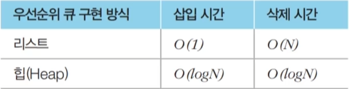

## 다익스트라 최단 경로 알고리즘
- 특정한 노드에서 출발하여 다른 모든 노드로 가는 최단 경로 계산
- 음의 간선이 없을 때 정상적으로 동작
- 그리디 알고리즘으로 분류: 매 상황에서 가장 비용이 적은 노드를 선택해 임의의 과정을 반복

<br>

### 알고리즘 동작 과정
1. 출발 노드 설정
2. 최단 거리 테이블 초기화 : 자기자신 0, 모든 노드까지의 비용 무한
3. 방문하지 않은 노드 중에서 최단 거리가 가장 짧은 노드 선택
4. 해당 노드를 거쳐 다른 노드로 가는 비용을 계산하여 최단 거리 테이블 갱신
5. 위 과정에서 3번, 4번 반복

<br>

### 특징
1. 그리디 알고리즘: 매 상황에서 방문하지 않은 가장 비용이 적은 노드를 선택해 임의의 과정을 반복
2. 단계를 거치며 한 번 처리된 노드의 최단 거리는 고정되어 더 이상 바뀌지 않음(한 단계당 하나의 노드에 대한 최단 거리를 확실히 찾는 것)
3. 다익스트라 알고리즘을 수행한 뒤에 테이블에 각 노드까지의 최단 거리 정보가 저장됨

<br>

### 구현

- 단계마다 방문하지 않은 노드 중에서 최단 거리가 가장 짧은 노드를 선택하기 위해 매 단계마다 1차원 테이블의 모든 원소를 확인(**순차 탐색**)

```python
import sys
input = sys.stdin.readline
INF = int(1e9)  # 무한을 의미하는 값으로 10억을 설정

# 노드의 개수, 간선의 개수를 입력 받기
n, m = map(int, input().split())

# 시작 노드 번호를 입력받기
start = int(input())

# 각 노드에 연결되어 있는 노드에 대한 정보를 담는 리스트를 만들기
graph = [[] for i in range(n + 1)]

# 방문한 적이 있는지 체크하는 목적의 리스트를 만들기
visited = [False] * (n + 1)

# 최단 거리 테이블을 모두 무한으로 초기화
distance = [INF] * (n + 1)

# 모든 간선 정보 입력받기
for _ in range(m):
    a, b, c = map(int, input().split())
    # a번 노드에서 b번 노드로 가는 비용이 c
    graph[a].append((b, c))

# 방문하지 않은 노드 중에서, 가장 최단 거리가 짧은 노드의 번호를 반환
def get_smallest_node():
    min_value = INF
    index = 0 # 가장 최단 거리가 짧은 노드(인덱스)
    for i in range(1, n+1):
        if distance[i] < min_value and not visited[i]:
            min_value = distance[i]
            index = i
    return index

def dijkstra(start):
    # 시작 노드에 대해서 초기화
    distance[start] = 0
    visited[strat] = True
    for j in graph[start]:
        distance[j[0]] = j[1]
    # 시작 노드를 제외한 전체 n - 1개의 노드에 대해 반복
    for i in range(n - 1):
        # 현재 최단 거리가 가장 짧은 노드를 꺼내서, 방문 처리
        now = get_smallest_node()
        visited[now] = True
        # 현재 노드와 연결된 다른 노드를 확인
        for j in graph[now]:
            cost = distance[now] + j[1]
            # 현재 노드를 거쳐서 다른 노드로 이동하는 거리가 더 짧은 경우
            if cost < distance[j[0]]:
                distance[j[0]] = cost

# 다익스트라 알고리즘 수행
dijkstra(start)

# 모든 노드로 가기 위한 최단 거리를 출력
for i in range(1, n + 1):
    # 도달할 수 없는 경우, 무한 (INFINITY)이라고 출력
    if distance[i] == INF:
        print("INFINITY")
    # 도달할 수 있는 경우 거리를 출력
    else:
        print(distance[i])
```

- **성능 분석**
    - 총 **O(V)**번에 걸쳐서 최단 거리가 가장 짧은 노드를 매번 선형 탐색해야 함
    - 시간 복잡도: **O(V^2)**
    - 노드의 개수가 5,000개 이하라면 문제 해결 가능

<br>

### 우선순위 큐(Priority Queue)
- 우선순위가 가장 높은 데이터를 가장 먼저 삭제하는 자료구조

<br>

#### 힙(Heap)
- 우선순위 큐를 구현하기 위해 사용하는 자료구조 중 하나
- **최소 힙**, **최대 힙**


<br>

- 최소 힙 파이썬 코드
```python
import heapq

def heapsort(iterable):
    h = []
    result = []
    # 모든 원소를 차례대로 힙에 삽입
    for value in iterable:
        heapq.heappush(h, value)
    # 힙에 삽입된 모든 원소를 차례대로 꺼내어 담기
    for i in range(len(h)):
        result.append(heapq.heappop(h))
    return result

result = heapsort([1, 3, 5, 7, 9, 2, 4, 6, 8, 0])
print(result)
```

- 최대 힙 파이썬 코드
```python
import heapq

def heapsort(iterable):
    h = []
    result = []
    # 모든 원소를 차례대로 힙에 삽입
    for value in iterable:
        heapq.heappush(h, -value)  # 최소 힙과 다른 점: 부호 바꾸기
    # 힙에 삽입된 모든 원소를 차례대로 꺼내어 담기
    for i in range(len(h)):
        result.append(-heapq.heappop(h)) # 최소 힙과 다른 점: 부호 다시 바꾸기
    return result

result = heapsort([1, 3, 5, 7, 9, 2, 4, 6, 8, 0])
print(result)
```

<br>

### 개선된 구현 방법
- **힙** 자료 구조 이용
- 기본 원리 동일
    - 현재 가장 가까운 노드를 저장해 놓기 위해 힙 자료구조를 추가적으로 이용한다는 점이 다름
    - 현재의 최단 거리가 가장 짧은 노드를 선택해야 하므로 **최소 힙**을 사용

- 파이썬 코드
```python
import heapq
import sys
input = sys.stdin.readline
INF = int(1e9)  # 무한을 의미하는 값으로 10억을 설정

# 노드의 개수, 간선의 개수를 입력 받기
n, m = map(int, input().split())

# 시작 노드 번호를 입력받기
start = int(input())

# 각 노드에 연결되어 있는 노드에 대한 정보를 담는 리스트를 만들기
graph = [[] for i in range(n + 1)]

# 최단 거리 테이블을 모두 무한으로 초기화
distance = [INF] * (n + 1)

# 모든 간선 정보 입력받기
for _ in range(m):
    a, b, c = map(int, input().split())
    # a번 노드에서 b번 노드로 가는 비용이 c
    graph[a].append((b, c))

def dijkstra(start):
    q = []
    # 시작 노드로 가기 위한 최단 경로는 0으로 설정, 큐에 삽입
    heapq.heappush(q, (0, start))
    distance[start] = 0
    while q: # 큐가 비어있지 않다면
        # 가장 최단 거리가 짧은 노드에 대한 정보 꺼내기
        dist, now = heapq.heappop(q)
        # 현재 노드가 이미 처리된 적이 있는 노드라면 무시
        if distance[now] < dist:
            continue
        # 현재 노드와 연결된 다른 인접한 노드들을 확인
        for i in graph[now]:
            cost = dist + i[1]
            # 현재 노드를 거쳐서, 다른 노드로 이동하는 거리가 더 짧은 경우
            if cost < distance[i[0]]:
                distance[i[0]] = cost
                heapq.heappush(q, (cost, i[0]))

# 다익스트라 알고리즘 수행
dijkstra(start)

# 모든 노드로 가기 위한 최단 거리를 출력
for i in range(1, n + 1):
    # 도달할 수 없는 경우, 무한 (INFINITY)이라고 출력
    if distance[i] == INF:
        print("INFINITY")
    # 도달할 수 있는 경우 거리를 출력
    else:
        print(distance[i])
```

- **성능 분석**
    - 시간 복잡도: **O(ElogV)**